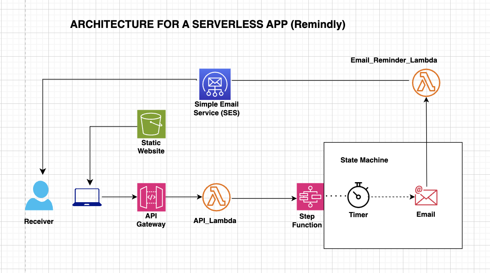

Remindly is a serverless reminder application designed to streamline event notifications via email. The application is hosted on an S3 bucket, enabling it to run directly in the browser while seamlessly interacting with AWS Lambda and Step Functions through an API Gateway endpoint.

With Remindly, users can configure and manage reminders for important events, ensuring timely email notifications. The application leverages the power of AWS Simple Email Service (SES) to deliver reminders efficiently. Initially operating in SES’s sandbox mode to maintain compliance and prevent spam, the application can later be configured for production, allowing emails to be sent to all users of the platform.

By combining serverless architecture and cloud-native services, Remindly offers a robust, scalable, and cost-effective solution for managing email reminders.

Here's the architecture

