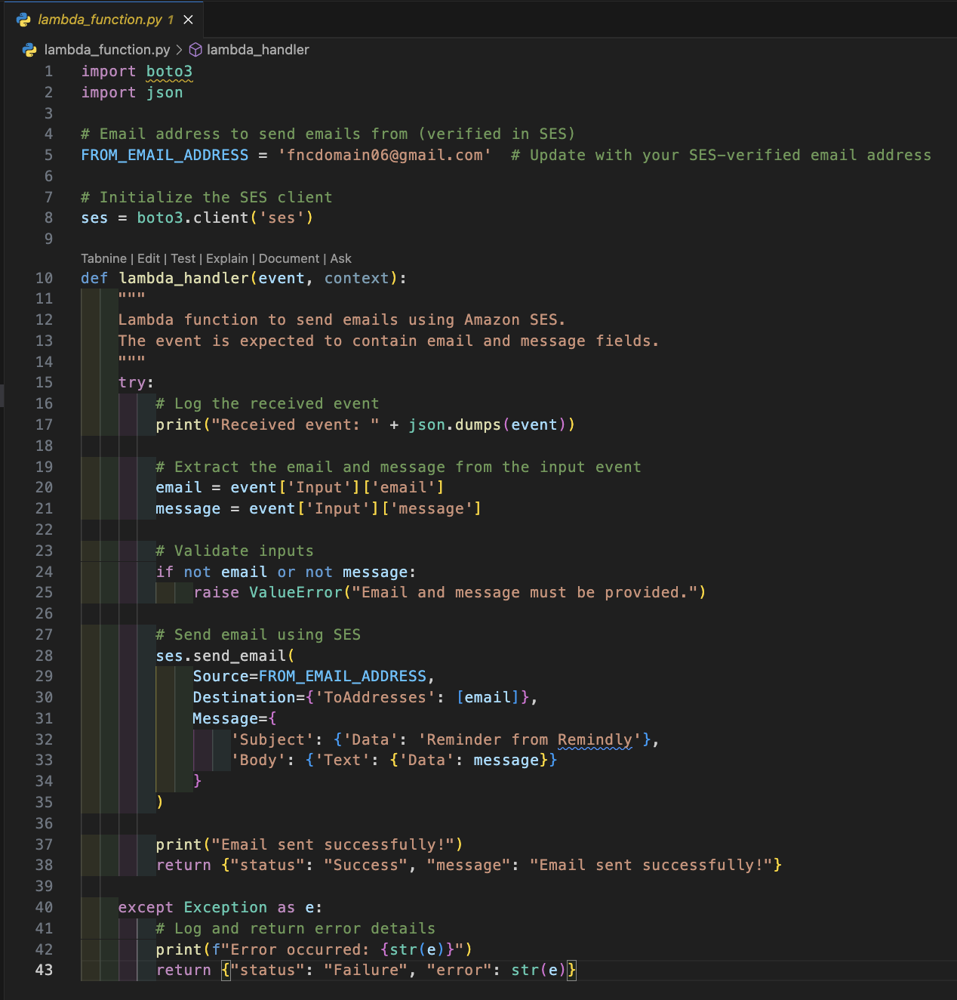

# Serverless Application for Email Reminder (Remindly)

__Remindly__ is a serverless reminder application designed to streamline event notifications via email. The application is hosted on an S3 bucket, enabling it to run directly in the browser while seamlessly interacting with AWS Lambda and Step Functions through an API Gateway endpoint.

With Remindly, users can configure and manage reminders for important events, ensuring timely email notifications. The application leverages the power of AWS Simple Email Service (SES) to deliver reminders efficiently. Initially operating in SES’s sandbox mode to maintain compliance and prevent spam, the application can later be configured for production, allowing emails to be sent to all users of the platform.

By combining serverless architecture and cloud-native services, Remindly offers a robust, scalable, and cost-effective solution for managing email reminders.

Here's the architecture

## This project consists of 6 stages of implementation with Terraform

1. Configure Simple Email service (SES)
2. Add an email lambda function to use SES to send emails for the serverless application
3. Implement and configure the state machine, the core of the application
4. Implement the API Gateway, API and supporting lambda function
5. Implement the static frontend application and test functionality
6. Create DNS in route 53 to point your domain name to the website endpoint

# Stage 1:

The Remindly application will send reminder messages Email. It will use the simple email service (SES). In production, it could be configured to allow sending from the application email, to any users of the application. SES starts off in sandbox mode, which means you can only send to verified addresses (to avoid you spamming).

There is a whole [process to get SES out of sandbox mode](https://docs.aws.amazon.com/ses/latest/dg/request-production-access.html), which we could do, but for this project to keep things quick - we will __verify the sender address__ and the __receiver address__.

### Create identities to be verified

- Specify the email the app will send from and the email that will receive.
You will receive an email to each address containing a link. Click the link in each address to verify.

`SES.tf`

# Stage 2a: Create the Lambda Execution Role for Lambda

- Create an IAM role which the email_reminder_lambda will use to interact with other AWS services.

`roles.tf`

__Notice__: that the Execution Role provides SES, SNS and Logging permissions to whatever assumes this role.
This is what gives lambda the permissions to interact with those services

# Stage 2b: Create email_reminder_lambda function

- Create lambda function which will be used by the serverless application to create an email and then send it using SES

`lambda.tf`

# Stage 2c: Configure the email_reminder_lambda function

`lambda_function.py`

This function will send an email to an address it's supplied with (by step functions) and it will be FROM the email address we specify.

# Stage 3a: Create State Machine Role

- Create an IAM role which the state machine will use to interact with other AWS services.

`roles.tf`

__Note__ how the State Machine role gives:

- logging permissions
- the ability to invoke the email lambda function when it needs to send emails
- the ability to use SNS to send text messages

# Stage 3b: Create State Machine and configure it with Amazon State Language (ASL)

`step_function.tf`

The state machine starts ... and then waits for a certain time period based on the Timer state. This is controlled by the web frontend. Then the email is used Which sends an email reminder.

The state machine will control the flow through the serverless application.. once stated it will coordinate other AWS services as required.

# Stage 4a: Create API Lambda Function Which Supports API Gateway

`lambda.tf`

This is the lambda function which will support the API Gateway

# Stage 4b: Configure The Lambda Function

This is the function which will provide compute to API Gateway.
This is the function which will provide compute to API Gateway.
It's job is to be called by API Gateway when its used by the serverless front end part of the application (loaded by S3) It accepts some information from you, via API Gateway and then it starts a state machine execution - which is the logic of the application.

`api_lambda.py`

# Stage 4c: Create API

create the API Gateway, API and Method which the frontend part of the serverless application will communicate with.

- Create the resource
- Create method and method response
- Create integration and integration response

`api_gateway.tf`

# Stage 5a: Create S3 Bucket

- Set the bucket as public
- Turn off block all public access
- Create bucket policy
- Enable static hosting
- Upload files to s3 bucket

- Verify All 4 files are in the Objects area of the bucket.

